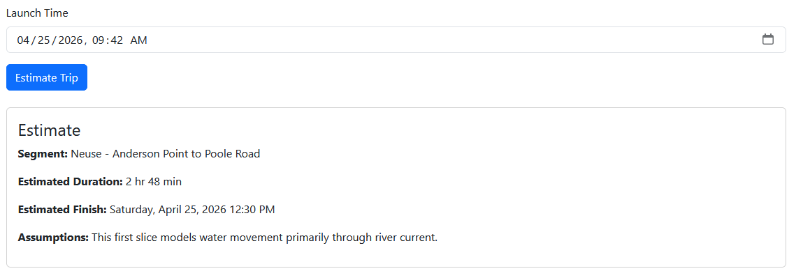
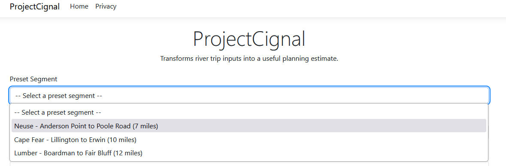

# ProjectCignal
Estimates river trip duration based on route and movement assumptions.

## What this is
ProjectCignal is a lightweight ASP.NET Core web application that helps estimate river trip duration.

Users can:
- select a preset river segment or enter a custom trip
- input paddling speed and river current
- optionally include a launch time

The system returns:
- estimated trip duration
- estimated finish time
- model assumptions

## Why I built it
I built this project to demonstrate two things:

1. I can take a real-world planning problem and turn it into a usable tool
2. I can ramp into a new stack (C# / .NET) and produce a clean, working application

This idea comes from a real gap I experienced—there wasn’t a simple way to estimate river travel time using clear assumptions.

## How it works

### Inputs
- River segment (preset or custom)
- Distance (miles)
- Paddling speed (mph)
- River current (mph)
- Launch time (optional)

### Output
- Estimated duration
- Estimated finish time

### Core logic
Effective speed is calculated as:

paddling speed + river current

Trip duration is:

distance / effective speed

## Preset segments
Preset segments provide:
- known distances
- default river current assumptions

These act as starting points and can be adjusted by the user.

## Model assumptions
- Water movement is modeled primarily as river current
- Other local water conditions (e.g., wind, tidal influence, obstructions) may affect actual trip time
- Estimates are directional, not guaranteed

## Tech stack
- ASP.NET Core (Razor Pages)
- C#
- .NET SDK

## Structure

Pages/
- Index.cshtml → UI and form
- Index.cshtml.cs → page handling

Services/
- TripEstimatorService → business logic

## What this demonstrates
- separation of UI and business logic
- dependency injection in .NET
- ability to ramp into a new language/environment
- domain modeling from a real-world use case

## Future improvements
- integration with USGS water data
- condition-based adjustments (flow, wind, seasonality)
- expanded river segment library
- route-based distance calculation

## Running locally

dotnet run

Then open the local URL shown in the terminal.

## Notes
This is a focused first slice of a larger idea. The goal was to build something usable and extensible, not to fully solve the problem space.